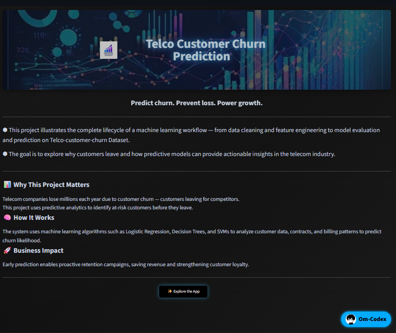
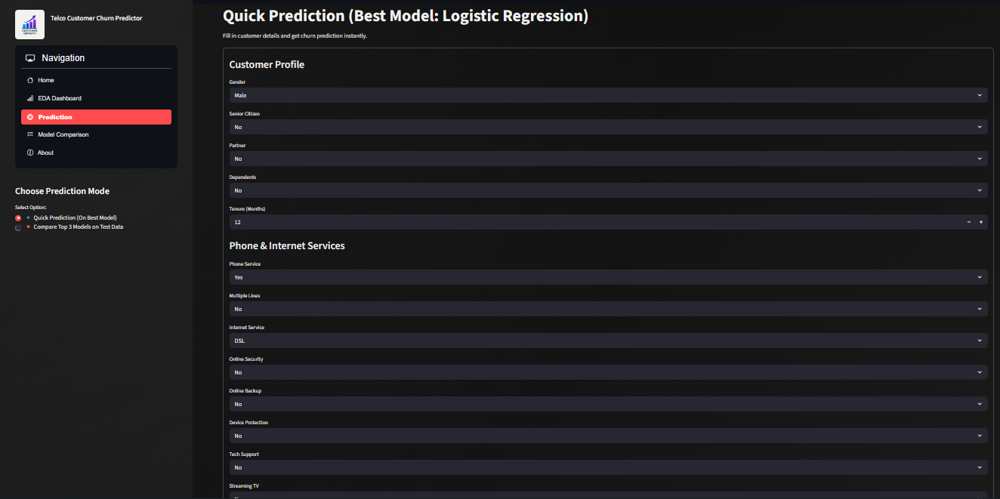
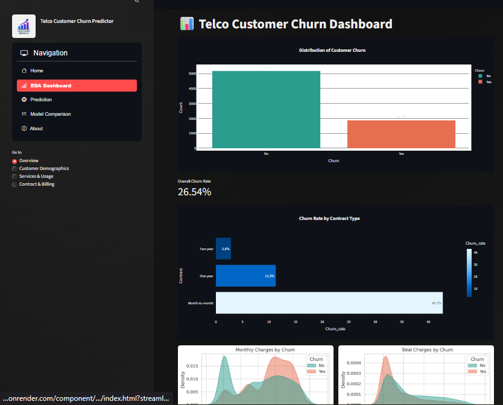
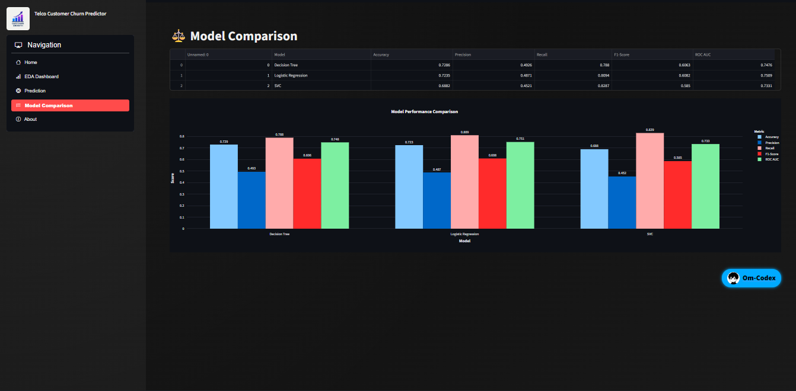

# 📊 Telco Customer Churn Prediction

**Predict churn. Prevent loss. Power growth.**

This repository presents a full machine learning pipeline for predicting customer churn for a telecom provider.  
From exploratory data analysis (EDA), through feature engineering and model building, to deployment as a user-friendly Streamlit web app.

💼 **Live App:** https://telco-customer-churn-prediction-om-codex.onrender.com/  
🔗 **Repo:** https://github.com/Om-codex/Telco-Customer-Churn-Prediction

---

## 🧠 Business Problem

Customer churn (when a subscriber leaves for a competitor) is a major challenge in the telecom industry.  
Acquiring new customers is more expensive than retaining existing ones — hence predicting churn early is vital.  
This project aims to identify at-risk customers using historical service, billing, and contract data, enabling strategic retention actions.

---
## 🖼️ App Screenshots

### Home Page


### Prediction Interface

(./app_images/Screenshot 2025-11-06 080201.png)

### EDA Dashboard

(./app_images/Screenshot 2025-11-06 080047.png)

### Model Comparison


---
## 📂 Dataset Overview

- **Rows:** ~7,000 customer records  
- **Features (~20+):**  
  - Demographics: Gender, SeniorCitizen, Partner, Dependents  
  - Service Usage: PhoneService, MultipleLines, InternetService, OnlineSecurity, OnlineBackup, DeviceProtection, TechSupport, StreamingTV, StreamingMovies  
  - Billing & Contract: Contract (Month-to-Month, One year, Two year), PaperlessBilling, PaymentMethod, MonthlyCharges, TotalCharges  
  - Target: `Churn` (Yes/No)  

---

## 🔍 Exploratory Data Analysis (EDA)

The notebook covers:

- Data loading, shape analysis, head of dataset  
- Summary of feature types, missing values, value counts  
- Univariate distributions (histograms, count plots) for numerical & categorical variables  
- Bivariate analysis: churn rate across features like contract type, payment method, service usage  
- Imbalance check: churn vs no-churn distribution  
- Correlation heatmap & feature correlation drop for highly correlated features  

**Key insights discovered:**

- Month-to-month contracts show much higher churn rate compared to one-year or two-year.  
- Electronic check payment method holds a high share of churners.  
- Higher monthly charges / tenure shorter correlate to increased churn probability.  
- Frequent customer service calls and high usage metrics link to greater churn.

---

## 🏗️ Feature Engineering & Preprocessing

- Categorical variables loaded and one-hot encoded (or label encoded) for model compatibility.  
- Numeric features scaled (StandardScaler or equivalent) to handle varying magnitudes.  
- Highly correlated features dropped to minimize multicollinearity (via upper-triangle correlation threshold).  
- Target variable converted to binary (Yes → 1, No → 0).  
- Data split into training and test sets, preserving class stratification.  

---

## 🤖 Model Building & Evaluation

Multiple models trained and compared:

- Baseline models: Logistic Regression, Decision Tree, SVM, KNN  
- Ensemble models: Random Forest, Voting Classifier  
- Gradient Boosting model: (e.g., XGBoost or equivalent) selected based on performance  

Metrics tracked:

- **Accuracy**: Overall correctness  
- **Precision**: Correct positive churn predictions / Total predicted churn  
- **Recall** (Sensitivity): Actual churners correctly predicted  
- **F1-Score**: Harmonic mean of precision & recall  
- **ROC-AUC**: Discrimination ability (where available)  

## 🧠 Model Selection & Performance

Multiple machine learning models were trained and evaluated including:

- Logistic Regression
- Decision Tree
- Support Vector Classifier (SVC)
- K-Nearest Neighbors (KNN)
- Random Forest
- AdaBoost
- XGBoost
- Voting Classifier

After comparing model performance using accuracy, precision, recall, F1-score, and ROC AUC, **Logistic Regression** was selected as the final model due to its strong balance between detecting churners (recall) and maintaining prediction stability.

### **Final Selected Model: Logistic Regression**

| Metric | Score |
|--------|--------|
| **Accuracy** | **72.35%** |
| **Precision** | **48.71%** |
| **Recall** | **80.94%** |
| **F1-Score** | **60.82%** |
| **ROC AUC** | **75.09%** |

**Why Logistic Regression?**

- It achieved the **highest recall**, meaning it correctly identifies most churn-risk customers.
- Recall is critical in churn prediction — missing a churner = potential revenue loss.
- The model offers transparency and interpretability, useful for business decision-making.

---

## 🌐 Web App Features (Streamlit)

- **Home/Welcome Page** with branding and project summary  
- **EDA Dashboard**: Interactive navigation for overview, service usage, contract & billing insights  
- **Prediction Interface**:  
  - Manual mode: user fills customer profile fields, get churn prediction & probability  
  - Batch mode: (optional) upload CSV of multiple customers for prediction  
- **Model Comparison**: Show key metrics of top models and explain selected model  
- **About Page**: Project objective, dataset, technologies, next steps  

---

> **Model Optimization Focus:** In churn prediction, recall is more important than accuracy.  
> Missing a churner costs the company more than incorrectly flagging a non-churn customer.  
> Logistic Regression delivered the best recall while maintaining strong overall performance.

---
## 🛠️ How to Run Locally

```bash
# Clone repository
git clone https://github.com/Om-codex/Telco-Customer-Churn-Prediction.git
cd Telco-Customer-Churn-Prediction

# Install dependencies
pip install -r requirements.txt

# Run the app
streamlit run app.py
---
## 🧰 Tech Stack

| Layer | Tools / Libraries |
|------|-------------------|
| **Data Science** | Python, Pandas, NumPy |
| **Visualization** | Matplotlib, Seaborn, Plotly |
| **Machine Learning** | Scikit-Learn, XGBoost |
| **Deployment** | Streamlit, Render.com |
| **Version Control** | Git, GitHub |
